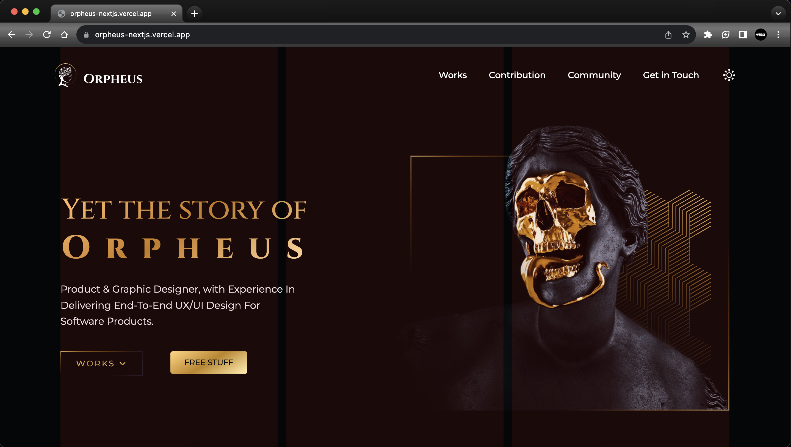

## About Project

- **Website Orpheus + Sculpture Avatars:** This project is a responsive and modern website built using [Next.js](https://nextjs.org/) for server-side rendering and [Tailwind CSS](https://tailwindcss.com/) for styling. It showcases the power of combining Next.js's seamless navigation and server-side rendering with Tailwind CSS's utility-first approach to styling.

- **Figma Design:** The refrence website design from [Figma](https://www.figma.com/community/file/1114495915109608886/Orpheus---Designer-Portfolio-(%2B-Sculpture-Avatars)).

- **Orpheus:** Orpheus is a hero in Greek mythology. When he played his lyre the world would sway to the music. It was noted he could charm mortals, Gods and even stones with his music. He was the son of a Muse. He was a companion of Jason and the Argonauts.

- **Sculpture Avatars:** Sculpture is the branch of the visual arts that operates in three dimensions. Sculpture is the three-dimensional art work which is physically presented in the dimensions of height, width and depth.

#### [Visit Website](https://orpheus-nextjs.vercel.app/)

    

